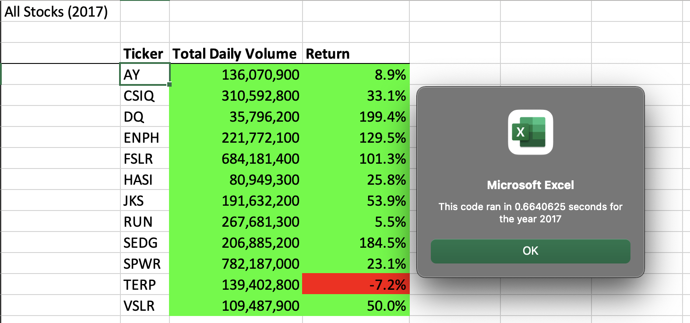
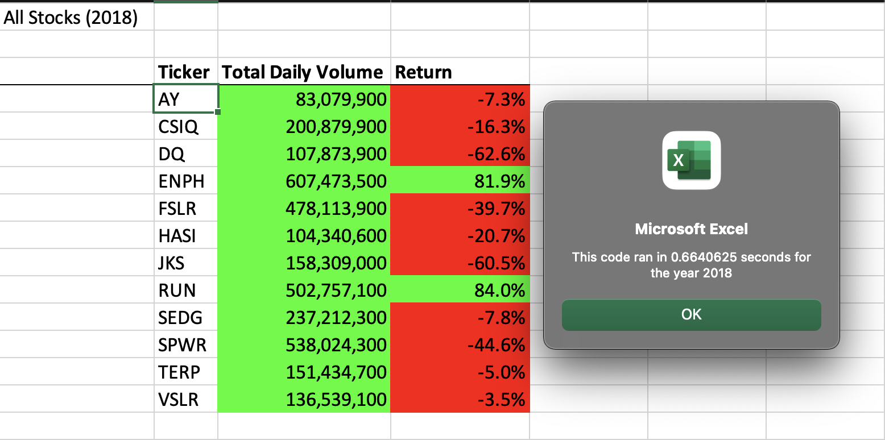

# VBA Challenge - Multiyear Stock Analysis 

## Overview of Project

Help Steve analyze multiple stocks and their performance (volume traded per day and yearly returns)

### Purpose

Analyze stocks based on their volumes traded per day, which is used to indicate whether the stock can be retained for a long term or short term, and their yearly returns.

### Analysis and Challenges

During the classwork, we started with understanding VBA, and its applications to automate repititive work. We started with analyzing DQ stock and then implemented the same analysis to multiple stocks using design patterns such as for loops. We also used dynamic inputs using the inputBox and applied the value while performing analysis.

## Results

Wrote a macro to loop through all the tickers, and calculated total daily volume and returns of that ticker in a given year. Also, formatted the values using VBA methods to help Steve analyze the data easily. This could come in handy when dealing with thousands of stocks. Also, implemented a button to refactor the stocks rather than opening the VB editor and running the macros manually.

### Inferences

  * Stocks performed well in 2017 compared to 2018, with only 1 stock yielding negative returns (TERP (-7.2%)). DQ returned almost 200% returns in 2017 ans SPWR has recorded largest daily volume in 2017

  

  * RUN has yielded 84% returns in 2018 and highest daily colume was recorded for ENPH

  

## Summary

  ### Refactoring code in general

    General refactoring coule help in understanding the concepts for beginners, but this is a tedious process and error prone as there is a manual intervention. The developer has to be diligent to apply refactoring to all branches of code and debugging could take a lot of time to figure out small issues.

  ### Refactoring code in VBA

  We refactored the code in the challenge to dynamically calculate start and end times for the script to run, and apply important formatting to the output values on the fly. This is helpful particularly when analyzing huge volumes of data. Also noted that the script took longer the first time and the runtime kept improving for subsequent runs.

  This method is advantageous especially when dealing with large datasets and lets the developer implement design patterns. 
